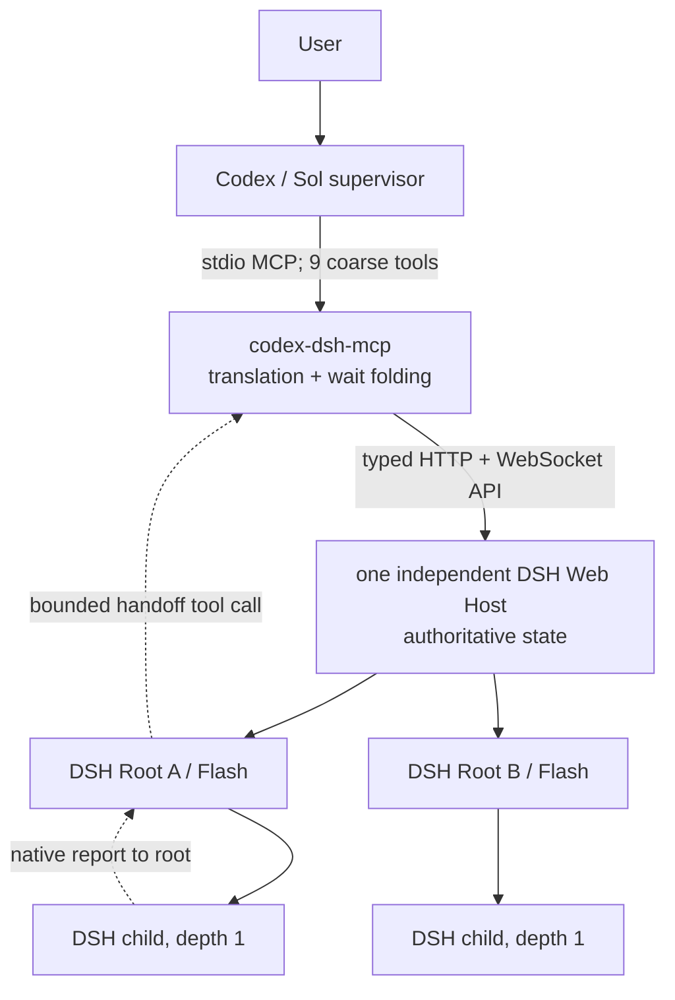
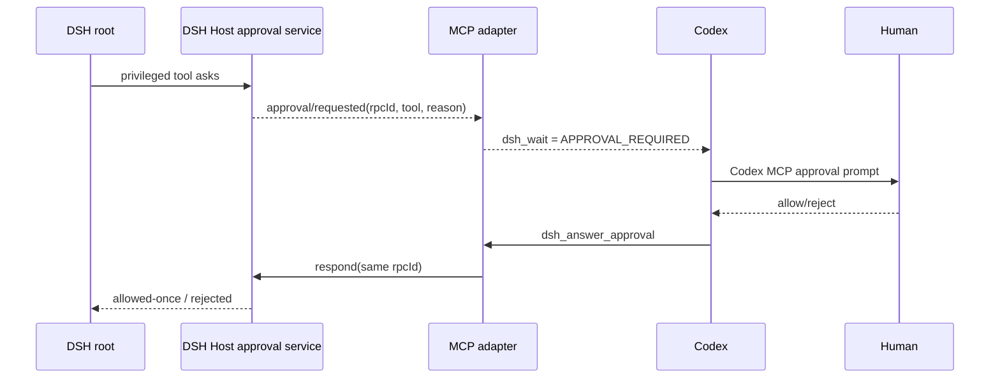

# Codex ↔ DeepSeek Harness: source-backed reuse and architecture review

Date: 2026-08-20 (design review; implementation carried out later)

Decision status: adopted with deviations — this document is the historical design review. The implementation
in this repository follows the architecture below (a small MCP translation surface, one independent DSH Web
Host, durable supervisor handoffs, and a bounded failure budget) with the deviations recorded in the README
and `docs/protocol.md`: the MCP surface is named `dsh-gate`, the task packet carries `writerMode` instead of
the proposed `accessMode`, and the DSH-core patch from section M remains a local, unreleased generic
compatibility patch rather than an upstream merge.

Target workspace: the repository root (this checkout)

## Executive decision

Build a local TypeScript stdio MCP server, not a new orchestration framework. Codex remains the supervisor; one independently-lived DSH Web Host owns any number of root sessions; each DSH root owns its children. The MCP process translates nine coarse operations into DSH's existing typed Web API and keeps no authoritative database. MCP exit or restart must never imply DSH Host shutdown.

Most of the required runtime already exists in DSH: session creation, durable history, event streams, steering, queueing, cancellation, approvals, questions, model selection, token projections, child lifecycle, child continuation/interrupt, workflows, and Ralph. The only defensible DSH-core change is a small public network-client/compatibility seam. The only genuinely new worker-runtime behavior is a small out-of-tree plugin that produces bounded, durable supervisor handoffs and mechanically enforces the recovery budget for worker-reported failures.

Do not use DSH's subprocess SDK JSON-RPC protocol, terminal scraping, Codex App Server, or a second persistence layer. Do not import any external project's process manager, worktree manager, scheduler, or database.

## Audit basis and freshness

- The implementation authority inspected was the actual local checkout of the DeepSeek Harness repository, branch `master`, commit `47f943859bef60e4160492346772ded9b24f765a`, packages `0.1.0-rc.5`, MIT.
- On 2026-08-20, upstream DSH HEAD was `141eb6fef83422698aef7a981029e843e8161534` (`0.1.0-rc.8`). I separately cloned it and rechecked the relevant API, event, subagent, fetch-client, WebSocket-client, reconnect, and repeat-guard files. The integration seams described below are unchanged; upstream still does not publicly expose a configurable remote network client, `host.describe.version` remains a placeholder, and `protocolVersion`/`hostInstanceId` remain reserved rather than implemented.
- The local checkout is clean but its tracking ref is stale relative to that audited upstream HEAD. After design approval, implementation should first branch from/reconcile to `141eb6f…`, not silently patch the older rc.5 baseline. No fetch, reset, or DSH source change was performed during this review.
- DSH explicitly describes itself as a rapidly changing developer preview, so the adapter must pin a compatible DSH version and negotiate an API protocol revision rather than assume semver compatibility. [DSH repository](https://github.com/deepseek-ai/deepseek-harness)
- Mandatory external repositories were inspected from fresh shallow clones at the exact revisions recorded below. Licenses were read from each checkout.

## A. DSH: what already exists

### Public package and contract surface

The primary dependency is `@deepseek-ai/dsh-host-apiproxy`:

- Package export map: [`packages/host/apiproxy/package.json`](https://github.com/deepseek-ai/deepseek-harness/blob/47f943859bef60e4160492346772ded9b24f765a/packages/host/apiproxy/package.json)
  - `.` exports the gateway plugin, `createApiProxy`, `toFetchHandler`, `AbstractApiClient`, `InProcessApiClient`, `RpcId`, and types.
  - `./api` and `./api/*` export browser-safe typed contracts and schemas.
  - `./client` exports the fetch-carrier `IApiClient` and `AbstractApiClient`.
- The complete typed domain tree is `ApiProxy` in [`packages/host/apiproxy/src/api/index.ts`](https://github.com/deepseek-ai/deepseek-harness/blob/47f943859bef60e4160492346772ded9b24f765a/packages/host/apiproxy/src/api/index.ts): sessions, subagents, host, workspace, skills, agent presets, events, goals, settings, credentials, LLM discovery, downloads, and `respond`.
- The client-facing shape is `IApiClient` in [`packages/host/apiproxy/src/fetch/client.ts`](https://github.com/deepseek-ai/deepseek-harness/blob/47f943859bef60e4160492346772ded9b24f765a/packages/host/apiproxy/src/fetch/client.ts). It owns RPC IDs, envelope validation, response validation, a 30-second default unary timeout, caller-only deadlines for user-paced calls, and stream decoding.
- Business failures are typed `RpcResult` values. HTTP status represents carrier failure, not business failure. The four quadrants are client request, server response, server request, and client response: [`packages/host/apiproxy/src/api/rpc.ts`](https://github.com/deepseek-ai/deepseek-harness/blob/47f943859bef60e4160492346772ded9b24f765a/packages/host/apiproxy/src/api/rpc.ts).

### Host and transport

- `dsh web` is a real alias for the Web profile. The shipped profile binds to `127.0.0.1:3080` by default and accepts an explicit port, including `0`: [`apps/cli/src/args.ts`](https://github.com/deepseek-ai/deepseek-harness/blob/47f943859bef60e4160492346772ded9b24f765a/apps/cli/src/args.ts), [`packages/bundle/web-app/cordis.patch.yml`](https://github.com/deepseek-ai/deepseek-harness/blob/47f943859bef60e4160492346772ded9b24f765a/packages/bundle/web-app/cordis.patch.yml), [`packages/host/webserver/src/index.ts`](https://github.com/deepseek-ai/deepseek-harness/blob/47f943859bef60e4160492346772ded9b24f765a/packages/host/webserver/src/index.ts). Current upstream rc.8 also supports `--no-open`, which the adapter-launched host should use: [`startup.ts`](https://github.com/deepseek-ai/deepseek-harness/blob/141eb6fef83422698aef7a981029e843e8161534/packages/bundle/web-app/src/startup.ts).
- Unary calls and `respond` are HTTP POST. Production event downlinks are two WebSockets at `/api/events.mux` and `/api/events.host`; ordinary GET receives 426. SSE is only the in-process fetch carrier, so a remote adapter must not treat the test/in-process SSE path as the production protocol: [`packages/client/connection/src/index.ts`](https://github.com/deepseek-ai/deepseek-harness/blob/47f943859bef60e4160492346772ded9b24f765a/packages/client/connection/src/index.ts).
- DSH already contains the required Web API client and reconnect loop in [`web-api-client.ts`](https://github.com/deepseek-ai/deepseek-harness/blob/47f943859bef60e4160492346772ded9b24f765a/packages/client/connection/src/client/web-api-client.ts) and [`connection.ts`](https://github.com/deepseek-ai/deepseek-harness/blob/47f943859bef60e4160492346772ded9b24f765a/packages/client/connection/src/client/connection.ts). They are deliberately package-internal today. Copying them into the adapter would be unnecessary duplication.
- `host.describe` returns version, cwd, default provider/model, attached session count, and native-open capability: [`host.ts`](https://github.com/deepseek-ai/deepseek-harness/blob/47f943859bef60e4160492346772ded9b24f765a/packages/host/apiproxy/src/api/host.ts). Its implementation still returns hard-coded `0.0.1`, and the contract explicitly defers `protocolVersion` until an independently released client exists. This adapter creates that exact condition.

Two nearby interfaces were inspected and rejected as the control plane:

- The SDK protocol in `packages/sdk/protocol`, `sdk/client`, and `sdk/server` is a newline-delimited JSON-RPC subprocess interface with only `initialize`, `session/prompt`, and `shutdown`, plus session/status and child-start/finish notifications. Its high-level client launches and owns one runtime process. It has no typed history, steer, cancel, queue, approval, question, or direct-child control calls, so using it would lose required behavior and prevent the shared Web Host architecture. Classification: **IGNORE for transport; TEST REFERENCE for subprocess teardown and protocol contract tests**. [`SDK protocol types`](https://github.com/deepseek-ai/deepseek-harness/blob/47f943859bef60e4160492346772ded9b24f765a/packages/sdk/protocol/src/types.ts)
- `@deepseek-ai/dsh-mcp-client` is an inbound bridge: DSH connects to external stdio or Streamable HTTP MCP servers and registers their tools on DSH's tool runtime. The required direction is the reverse—Codex calls a server that controls DSH—so this package is not reusable as the adapter. Classification: **TEST REFERENCE** for transport/reconnect cases only. [`DSH MCP client`](https://github.com/deepseek-ai/deepseek-harness/tree/47f943859bef60e4160492346772ded9b24f765a/packages/mcp/mcp-client)

### Session controls

Reuse the methods in [`sessions.ts`](https://github.com/deepseek-ai/deepseek-harness/blob/47f943859bef60e4160492346772ded9b24f765a/packages/host/apiproxy/src/api/sessions.ts):

- `session.create`: optional client-preallocated ID, cwd/workspace, and agent preset. Retrying the same ID/cwd is idempotent.
- `session.list`: returns the authoritative session-header `cwd` for both live and cold sessions, so workspace-sensitive validation can be reconstructed after MCP restart rather than trusting a handoff-supplied root.
- `session.prompt`: `queue` or `steer` mode and content blocks.
- `session.history`: reads live or cold persisted history without resuming the agent; tail pages carry projection baselines.
- `session.cancel`: stops the active turn while preserving the queued FIFO.
- `session.updateQueue`: edit, remove, or steer pending items.
- `session.models`, `session.selectModel`, `session.rename`, and `session.fork` remain available internally but do not need separate MCP tools in the initial surface.

Session events are append-only and are the source of truth. JSONL and SQLite backends, crash repair, and checkpoint barriers already exist in `packages/session/session-persistence`, `packages/session/session-checkpoint-policy`, and `packages/session/session-projection`. The adapter must not add `tasks.db`, `runs.json`, or its own event log.

### Events, waiting, reconnect, and projections

[`events.ts`](https://github.com/deepseek-ai/deepseek-harness/blob/47f943859bef60e4160492346772ded9b24f765a/packages/host/apiproxy/src/api/events.ts) provides:

- `events.mux`: all-session session events, subscription baselines, approval/question requests and resolutions, full queue/job snapshots, and projection changes.
- `events.host`: session add/remove/running status, agent errors, workspace changes, and forwarded allowlisted remote events.
- `since` is currently ignored. Correct reconnect is: reopen both streams, establish the subscription baseline, then refetch durable session history and fold only higher sequence numbers. DSH's existing `ConnectionController` already owns physical reconnect and readiness. Any `asOfSeq`/`boundarySeq` returned by MCP is therefore an observation marker and deduplication aid, never a claim that DSH supports server-side cursor resume.
- The session-event wire schema has a strict envelope but intentionally wide event type/data, so an out-of-tree tool's ordinary `tool/call` and `tool/result` records survive the carrier without adding a new API event variant: [`sessions.schema.ts`](https://github.com/deepseek-ai/deepseek-harness/blob/47f943859bef60e4160492346772ded9b24f765a/packages/host/apiproxy/src/api/sessions.schema.ts).

### Approvals and questions

- `ApprovalService` has durable `approval/asked` + `approval/decided` audit pairs, policies `ask` and `never`, fail-closed behavior, and one-shot grants only: [`packages/interaction/user-approval/src/index.ts`](https://github.com/deepseek-ai/deepseek-harness/blob/47f943859bef60e4160492346772ded9b24f765a/packages/interaction/user-approval/src/index.ts).
- The API gateway converts a pending approval into an answerable `approval/requested` mux frame with a stable RPC ID, replays it after client reconnect, validates the response, and emits `approval/resolved`. The same server-request/client-response pattern handles questions in [`api-proxy.ts`](https://github.com/deepseek-ai/deepseek-harness/blob/47f943859bef60e4160492346772ded9b24f765a/packages/host/apiproxy/src/api-proxy.ts).
- Pending interaction promises live in the DSH Host process. Adapter restart is safe; Host restart while an interaction is pending loses that in-memory promise even though the audit records remain. The report treats this as a DSH limitation, not a reason to add an adapter approval database.

### Subagents

- [`subagents.ts`](https://github.com/deepseek-ai/deepseek-harness/blob/47f943859bef60e4160492346772ded9b24f765a/packages/host/apiproxy/src/api/subagents.ts) provides durable direct-child listing, cold-safe child history, continuable-child prompt, and direct-child emergency interrupt.
- DSH roots already have `subagent`, `send_message`, `interrupt_agent`, `list_agents`, and child `report` tools in `packages/subagent/tool-subagent`, `tool-subagent-control`, and `tool-subagent-report`. Codex should not reproduce them.
- Delegation depth is durable. Root depth is 0, child depth is 1, and `maxDepth` is an absolute cap. Configure `maxDepth: 1` to forbid grandchildren: [`packages/subagent/subagent/src/depth.ts`](https://github.com/deepseek-ai/deepseek-harness/blob/47f943859bef60e4160492346772ded9b24f765a/packages/subagent/subagent/src/depth.ts).
- Normal Codex steering targets the root. The MCP child surface is read-only catalog visibility plus `subagent.interrupt`; it deliberately omits child prompting.

### Workflows, Ralph, tokens, and existing anti-loop behavior

- Reuse `packages/workflow/workflow`, `tool-workflow`, `workflow-worker-thread`, and `tool-ralph`. Do not put a workflow engine in MCP.
- Reuse token projections from `packages/llm/token-meter`: uncached input, output, cache read, cache write, and context pressure. Dollar cost and Sol quota are later metrics-layer concerns, not model-context fields.
- [`repeat-tool-reminder`](https://github.com/deepseek-ai/deepseek-harness/blob/47f943859bef60e4160492346772ded9b24f765a/packages/guard/repeat-tool-reminder/src/index.ts) detects only exact consecutive tool+argument repetition at configured thresholds and is advisory. It does not enforce a bounded recovery budget over worker-reported failure attempts.
- DSH tools can call `ToolRunContext.concludeTurn()`. That existing primitive lets a small out-of-tree tool emit a durable result and end the worker turn mechanically; no agent-loop rewrite is needed: [`packages/core/tools/src/index.ts`](https://github.com/deepseek-ai/deepseek-harness/blob/47f943859bef60e4160492346772ded9b24f765a/packages/core/tools/src/index.ts).

### DSH changes actually required

The worker tools do not require a core fork. DSH already supports profile-local package installation (`dsh plugin --profile …`) and ordered profile/patch overlays, so the handoff/failure tool package can remain out of tree: [`apps/cli/src/args.ts`](https://github.com/deepseek-ai/deepseek-harness/blob/47f943859bef60e4160492346772ded9b24f765a/apps/cli/src/args.ts), [`apps/cli/src/profile-boot.ts`](https://github.com/deepseek-ai/deepseek-harness/blob/47f943859bef60e4160492346772ded9b24f765a/apps/cli/src/profile-boot.ts).

One small upstreamable change set is justified:

1. Publicly export the existing network client and reconnect controller from `@deepseek-ai/dsh-client-connection/client`.
2. Let the existing `WebApiClient` accept an explicit base URL rather than relying only on browser `location`.
3. Add `protocolVersion` and a per-process `hostInstanceId` to `host.describe`, and replace the placeholder product version with the real lockstep DSH package/distribution version.
4. Add focused export, explicit-base, schema, and describe tests.

This patch must remain generic and upstreamable: no Codex imports, MCP concepts, supervisor tool names, task statuses, recovery policy, or adapter lifecycle logic may enter DSH core. It exposes a reusable network-client seam and honest Host compatibility metadata only.

Estimated DSH production delta: 40–80 LOC; tests: 120–200 LOC. If upstream declines the public client export, the fallback is a roughly 90–140 LOC adapter subclass over `AbstractApiClient`; that is second choice because it copies the WebSocket carrier seam.

## B. Codex integration choice

Codex officially supports local stdio MCP servers and Streamable HTTP MCP servers. The desktop app, CLI, and IDE extension share MCP configuration; project-local `.codex/config.toml` is supported for trusted projects. Server `instructions` are also supported. [Official Codex MCP documentation](https://learn.chatgpt.com/docs/extend/mcp?surface=cli)

Recommendation:

- Use a local stdio MCP server through the current official TypeScript MCP v2 server package, `@modelcontextprotocol/server`, with `@modelcontextprotocol/server/stdio`. This is the smallest local deployment and lets Codex own the adapter process. [`modelcontextprotocol/typescript-sdk`](https://github.com/modelcontextprotocol/typescript-sdk)
- Pin the MCP server dependency and DSH package compatibility range. Keep stdout exclusively for MCP; logs go to stderr or a bounded log file.
- Install a Codex supervisor Skill as well. MCP `instructions` should carry the short cross-tool contract; the Skill carries delegation, fanout, approval, anti-stuck, and final-review behavior. Tools alone cannot encode those policies clearly.
- Configure `dsh_answer_approval` with Codex's per-tool `approval_mode = "prompt"`. This creates a human gate around the only operation that can grant DSH a one-shot privileged action. Question answers use a separate tool and do not inherit that security friction.
- Do not use Codex App Server. App Server is for embedding Codex into a separate rich client/product with Codex authentication, history, approvals, and streamed events. Here Codex is already the client and supervisor. [Official Codex App Server documentation](https://learn.chatgpt.com/docs/app-server)

## C. External open-source audit

### `awslabs/cli-agent-orchestrator`

- Revision: `e453bf86419088076220a8ab114e4bb60d987aa4`; Apache-2.0 plus NOTICE.
- Useful source:
  - [`src/cli_agent_orchestrator/ops_mcp_server/server.py`](https://github.com/awslabs/cli-agent-orchestrator/blob/e453bf86419088076220a8ab114e4bb60d987aa4/src/cli_agent_orchestrator/ops_mcp_server/server.py): compact external MCP lifecycle tools and server instructions.
  - [`docs/agent-profile.md`](https://github.com/awslabs/cli-agent-orchestrator/blob/e453bf86419088076220a8ab114e4bb60d987aa4/docs/agent-profile.md): profile/capability metadata.
  - [`src/cli_agent_orchestrator/utils/tool_mapping.py`](https://github.com/awslabs/cli-agent-orchestrator/blob/e453bf86419088076220a8ab114e4bb60d987aa4/src/cli_agent_orchestrator/utils/tool_mapping.py) and `constants.py`: role defaults and provider-native tool mapping.
  - [`src/cli_agent_orchestrator/services/worktree_service.py`](https://github.com/awslabs/cli-agent-orchestrator/blob/e453bf86419088076220a8ab114e4bb60d987aa4/src/cli_agent_orchestrator/services/worktree_service.py): safe naming and bounded git subprocess patterns.
- Decision: design/test reference only. Keep its small lifecycle-tool shape and role-separation principle. Do not import the Python/FastMCP server, tmux/session manager, REST server, worktree manager, or provider mapping. DSH has a stronger typed native API. CAO also has provider-dependent soft enforcement and an unknown-role fallback unsuitable as our authority boundary. [Repository](https://github.com/awslabs/cli-agent-orchestrator)
- Expected benefit: avoid rediscovering the coarse supervisor surface, role vocabulary, and lifecycle/error test cases without adding a second process manager.

### `1345191768/multiAgents`

- Revision: `3df6b355b73b4727b7cf2dc14338928e256c839f`; MIT.
- Useful source:
  - [`skills/ma-codex/SKILL.md`](https://github.com/1345191768/multiAgents/blob/3df6b355b73b4727b7cf2dc14338928e256c839f/skills/ma-codex/SKILL.md): Codex-as-coordinator/reviewer behavior.
  - [`adapters/codex/prompts/ma-codex.md`](https://github.com/1345191768/multiAgents/blob/3df6b355b73b4727b7cf2dc14338928e256c839f/adapters/codex/prompts/ma-codex.md) and [`adapters/codex/bridge/config.example.toml`](https://github.com/1345191768/multiAgents/blob/3df6b355b73b4727b7cf2dc14338928e256c839f/adapters/codex/bridge/config.example.toml): thin prompt adapter, host/worker boundary, resume/handoff policy, dirty-worktree safety, and role-profile configuration.
  - [`src/ma/role_packet.py`](https://github.com/1345191768/multiAgents/blob/3df6b355b73b4727b7cf2dc14338928e256c839f/src/ma/role_packet.py): bounded objective, ownership, acceptance, verification, reporting, and stop conditions.
  - [`src/ma/artifact_manifest.py`](https://github.com/1345191768/multiAgents/blob/3df6b355b73b4727b7cf2dc14338928e256c839f/src/ma/artifact_manifest.py): relative-path, regular-file, size, SHA-256, symlink, and hardlink checks.
  - [`src/ma/models.py`](https://github.com/1345191768/multiAgents/blob/3df6b355b73b4727b7cf2dc14338928e256c839f/src/ma/models.py): `DONE`, `DONE_WITH_CONCERNS`, `NEEDS_CONTEXT`, and `BLOCKED` vocabulary.
- Decision: adapt the Codex skill/task-packet pattern and port the small artifact-manifest algorithm with MIT attribution. Do not adopt its Python runtime, Claude/LiteLLM bridge, run database/files, worktree orchestration, or event log; those would compete with DSH. [Repository](https://github.com/1345191768/multiAgents)
- Expected benefit: a proven bounded delegation/review vocabulary and safe lazy artifact manifest, while DSH replaces MA's worker bridge and persistence.

### `maxto/agent-mux`

- Revision: `b041ed5365161774c47fb9e944e96d1196f7694f`; MIT.
- Useful source: [`scripts/tmux-agent`](https://github.com/maxto/agent-mux/blob/b041ed5365161774c47fb9e944e96d1196f7694f/scripts/tmux-agent), especially `thread_base`, `thread_write[_file]`, `_send_thread`, the 2 KiB inline threshold, compact ping, per-reader cursor, audit JSONL, and pause switch.
- Decision: adapt the protocol rule, not the Bash/tmux implementation. Handoff fields stay bounded and inline; artifact bodies remain regular files referenced by path, size, and digest. Do not add tmux, pane injection, sentinel polling, or a second thread store. [Repository](https://github.com/maxto/agent-mux)
- Expected benefit: keep Sol context small through a measured inline/file threshold and lazy evidence loading, with none of the terminal machinery.

### `buildoak/agent-mux`

- Revision: `4a27d544f8beeee172d9a509d917342a27ca9d7a`; MIT.
- Useful source:
  - [`internal/types/types.go`](https://github.com/buildoak/agent-mux/blob/4a27d544f8beeee172d9a509d917342a27ca9d7a/internal/types/types.go): versioned dispatch result, structured errors, activity, tokens, session ID.
  - [`internal/engine/adapter/registry.go`](https://github.com/buildoak/agent-mux/blob/4a27d544f8beeee172d9a509d917342a27ca9d7a/internal/engine/adapter/registry.go): narrow adapter interface.
  - [`internal/dispatch/status.go`](https://github.com/buildoak/agent-mux/blob/4a27d544f8beeee172d9a509d917342a27ca9d7a/internal/dispatch/status.go), `persistence.go`, and `recovery.go`: atomic status, durable result, and recovery patterns.
  - Adapter parser tests under `internal/engine/adapter/*_test.go`.
- Decision: protocol/schema adaptation and test reference only. Preserve the distinction between transport status and task status, actionable error fields, partial artifacts, and adapter contract tests. Do not import the Go binary, process supervisor, provider registry, persistence, recovery store, or FIFO steering; DSH already owns those layers. [Repository](https://github.com/buildoak/agent-mux)
- Expected benefit: a cleaner versioned MCP boundary and better failure diagnostics without inventing a universal harness abstraction.

### `obra/superpowers`

- Revision: `b36e0829c6d0140e93cfef2ca599b1b07d4a7797`; MIT.
- Useful source:
  - [`skills/subagent-driven-development/SKILL.md`](https://github.com/obra/superpowers/blob/b36e0829c6d0140e93cfef2ca599b1b07d4a7797/skills/subagent-driven-development/SKILL.md): narrow child context, controller-owned coordination, artifact handoff, review loops.
  - [`skills/systematic-debugging/SKILL.md`](https://github.com/obra/superpowers/blob/b36e0829c6d0140e93cfef2ca599b1b07d4a7797/skills/systematic-debugging/SKILL.md): reproduce → evidence → one hypothesis → minimal test.
  - [`skills/verification-before-completion/SKILL.md`](https://github.com/obra/superpowers/blob/b36e0829c6d0140e93cfef2ca599b1b07d4a7797/skills/verification-before-completion/SKILL.md): fresh evidence before completion claims.
  - `using-git-worktrees` and `requesting-code-review`: isolation decision and review packaging.
- Decision: adapt concise behavioral content with attribution; do not copy the full 1,200+ line workflow or its fixed review/repair machinery. DSH's native children and Codex's own review capability replace that machinery. The requested two-report recovery budget is stricter than upstream's three-fix architecture stop, so our runtime rule must be explicit about what it can and cannot detect. [Repository](https://github.com/obra/superpowers)
- Expected benefit: mature reuse-first, evidence-first debugging, verification, isolation, and review behavior in two short Skills rather than new orchestration code.

### Additional current search

Current searches also found Overstory, agentproto, Hydra, Codex-specific MCP swarms, and an unrelated project that also uses the name `deepseek-harness`. Overstory and agentproto contain mature multi-runtime orchestration, mail/databases, worktrees, watchdogs, and provider adapters, but importing either would replace or duplicate DSH rather than bridge it. The same is true of the desktop/swam projects. They are therefore ignored for this scope after comparison, not overlooked. [Overstory](https://github.com/jayminwest/overstory), [agentproto](https://github.com/agentproto/ts)

Exact audit classifications:

| Source | Classification used here |
|---|---|
| Official MCP TypeScript SDK v2 server/stdio packages | **DIRECT IMPORT** |
| DSH `host-apiproxy` typed API | **DIRECT IMPORT** |
| DSH session, interaction, persistence, subagent, workflow, Ralph, token-meter, repeat guard | **DIRECT REUSE** |
| DSH Web API client/reconnect controller | **FORK/ADAPT** only as a tiny upstream export/configuration patch; no copied fork in this repository |
| DSH SDK JSON-RPC | **TEST REFERENCE**; otherwise **IGNORE** |
| DSH MCP client | **TEST REFERENCE**; otherwise **IGNORE** because direction is reversed |
| CAO | **DESIGN REFERENCE ONLY** and **TEST REFERENCE** |
| multiAgents coordinator/packet vocabulary | **PROTOCOL/SCHEMA REUSE** |
| multiAgents artifact manifest | **PORT SMALL MODULE** with MIT attribution |
| maxto agent-mux | **PROTOCOL/SCHEMA REUSE**; Bash/tmux runtime **IGNORE** |
| buildoak agent-mux | **PROTOCOL/SCHEMA REUSE** and **TEST REFERENCE**; Go runtime **IGNORE** |
| Superpowers named workflows | **COPY WITH ATTRIBUTION** only for short behavioral fragments; otherwise **DESIGN REFERENCE ONLY** |
| Overstory, agentproto, Hydra, swarm/process/worktree layers | **IGNORE** |

## D. Reuse matrix

`LOC` means expected production code in this project unless the row explicitly says DSH core. It excludes tests/docs.

| Component | Requirement | Existing repository / exact module | Behavior and license | Decision | Required change | LOC |
|---|---|---|---|---|---|---:|
| Codex supervisor Skill | Delegate bounded work, wait, review, avoid micromanagement | multiAgents `skills/ma-codex/SKILL.md`; Superpowers named skills | Mature coordinator/debug/review guidance; MIT | ADAPT | Compress and retarget to nine DSH MCP tools | 120–180 prose |
| MCP bootstrap | Supported local Codex transport | `modelcontextprotocol/typescript-sdk`, `@modelcontextprotocol/server/stdio` | Official stdio server package; repository Apache-2.0/new + MIT/existing | DIRECT | Register tools/instructions; stderr logging only | 60–90 |
| MCP tool shape | Small external supervisor surface | CAO `ops_mcp_server/server.py` | Lifecycle-oriented MCP tools; Apache-2.0 | REFERENCE | TypeScript implementation over DSH | 0 copied |
| DSH typed client | Unary calls, server responses, validation | DSH apiproxy `./api`, `./client` | Full typed RPC; MIT | DIRECT | Import public packages | 20–40 glue |
| DSH network carrier | HTTP up, WebSocket down | DSH `web-api-client.ts` | Already implemented; MIT | ADAPT | Tiny public export + explicit base URL | 15–30 DSH |
| Reconnect controller | Dual-stream handshake/backoff | DSH `connection.ts` | Already implemented; MIT | ADAPT | Public export only | 2–10 DSH |
| Host compatibility | Reuse one compatible host | DSH `host.describe` | Version currently placeholder; no protocol ID | ADAPT | Add protocol version, instance ID, real version | 25–50 DSH |
| Host discovery/start | Probe configured URL; start only if absent | DSH `dsh web`, default 3080 | Real Web Host and readiness RPC; MIT | ADAPT | Independent launch, bounded readiness; MCP never owns Host shutdown | 100–150 |
| Session identity/create | Durable root identity | DSH `session.create` | Client-preallocated idempotent ID | DIRECT | `taskId === sessionId` | 10–20 |
| Task packet | Objective/scope/acceptance/escalation | multiAgents `role_packet.py` | Structured assignment; MIT | PROTOCOL/SCHEMA REUSE | Zod schema, bounded text/arrays | 90–140 |
| Task dispatch | Create root and prompt | DSH `session.create`, `session.prompt` | Native live agent + FIFO/steer | DIRECT | Two calls with error normalization | 30–50 |
| Wait/event behavior | Meaningful boundaries, no tool chatter | DSH mux/host/history + ConnectionController | Event-driven, durable history, resync | ADAPT | Boundary fold, observation sequences, typed wait/failure outcomes | 180–260 |
| Durable handoff signal | Completed/blocked/checkpoint/failed | DSH logged `tool/call` + `tool/result`; `concludeTurn()` | Existing durable vocabulary and hard turn conclusion | NEW SMALL PLUGIN | Register bounded `supervisor_handoff` tool | 100–150 |
| Steering | Supervisor to root | DSH `session.prompt(mode:'steer')` | Native steering/queue semantics | DIRECT | One coarse MCP tool | 15–25 |
| Questions | Human/context answer | DSH `question/requested` + `respond` | Stable RPC ID and validation | DIRECT | Separate answer tool | 20–35 |
| Approvals | Human-only one-shot grant | DSH approval frames + `respond`; Codex per-tool approval | Fail-closed durable audit; MIT | DIRECT | Separate MCP tool, force Codex `prompt` approval mode | 20–35 |
| Cancellation | Stop root turn, retain queue | DSH `session.cancel` | Native cancellation and convergence | DIRECT | One MCP tool | 10–20 |
| Subagent visibility | Compact direct-child catalog | DSH `subagent.list` | Durable/cold-safe direct children | DIRECT | Return no transcripts; flag unexpected grandchildren | 20–40 |
| Emergency child interrupt | Narrow runaway control | DSH `subagent.interrupt` | Direct-parent authority, accepted not quiescent | DIRECT | One MCP tool; no child messaging | 15–25 |
| Delegation depth | Root → child only | DSH `maxDepth`, durable depth | Absolute root-relative cap | DIRECT | Profile sets `maxDepth: 1` | 0–5 |
| Normalized result | Compact task vs transport status | buildoak `types.go`; multiAgents statuses | Versioned/actionable schemas; MIT | ADAPT | DSH-specific Zod boundary schema | 100–150 |
| Artifact handoff | File refs, size/digest, no transcript | multiAgents `artifact_manifest.py`; maxto thread pattern | Safe manifest + lazy payload; MIT | PORT SMALL MODULE | Resolve against session workspace, realpath containment, regular-file checks; preserve notice | 60–90 |
| Failure accounting | Bound recovery for reported failures | DSH tool log + `concludeTurn`; Superpowers debugging | No semantic root-cause classifier exists | NEW SMALL PLUGIN | `supervisor_report_failure`; enforce reported budget since latest durable task packet | 120–180 |
| Existing exact-repeat guard | Catch literal loops | DSH `repeat-tool-reminder` | Advisory exact repetition | DIRECT | Keep enabled as complementary guard | 0 |
| Role/permission model | Supervisor/read/reviewer/developer separation | DSH presets/sandbox/approval; CAO roles | DSH enforceable, CAO conceptual | ADAPT | Preset config; no adapter RBAC database | 20–40 config |
| Worktrees | Only parallel root writers | Codex/git; CAO and Superpowers references | Mature isolation patterns | REFERENCE | One writer per shared tree; existing worktrees for parallel writers; no lock manager | 0 |
| Persistence/restart | Adapter restart without losing Host/task | DSH Host + session persistence/history | DSH authoritative and crash-repairing | DIRECT | Host outlives MCP; rebuild cache from history | 20–40 included above |
| Token telemetry | DSH usage without context pollution | DSH token-meter projections | Native input/cache/output telemetry | DIRECT | Optional compact metrics fields, off by default | 25–40 |
| Workflows/Ralph | Worker-owned complex execution | DSH workflow/tool-workflow/tool-ralph | Already native | DIRECT | No MCP methods | 0 |
| Tests | Contract, reconnect, failure, authority, e2e | DSH carrier tests; buildoak adapter tests; CAO MCP tests | Strong patterns, compatible licenses | TEST REFERENCE | Vitest unit/integration + real smoke | 700–1,000 test LOC |

Estimated reuse:

- Directly reused: about 85–90% of runtime behavior; more than 16,000 lines of existing DSH API/client/session/subagent/workflow implementation are invoked rather than copied.
- Adapted/ported: roughly 180–300 production lines plus 120–180 lines of Skill content. Any ported artifact-manifest code retains its MIT notice and exact commit provenance.
- Net-new production TypeScript: roughly 900–1,200 lines in this repository, plus 40–80 lines in DSH core. Tests add roughly 700–1,000 lines. Docs/skills/config add roughly 250–400 lines.

## E. Proposed final architecture



State ownership:

- DSH: sessions, turns, queue, history, projections, approvals, questions, usage, children, workflows, failure-attempt tool records.
- MCP process: socket/controller objects, bounded in-memory folds, waiter promises, and at most a non-owning launch receipt. All are disposable and reconstructible. It registers no exit hook that stops DSH and exposes no Host-stop tool.
- Codex: the user conversation, strategic plan, review decisions, and explicit task IDs (which are DSH session IDs).
- Filesystem/git: code and deliberately produced artifacts. There is no adapter-owned run database.

Lifecycle invariant: the DSH Host is a peer service, not a child resource of the stdio MCP session. If MCP starts it, the process is detached/non-owning with stdio redirected; MCP restart reconnects to the same `hostInstanceId` and sessions. Host shutdown remains an explicit operator action outside this MCP surface.

## F. Proposed MCP contract

| Tool | Purpose | DSH mapping | Important constraint |
|---|---|---|---|
| `dsh_start_or_connect` | Probe configured host; optionally start one independently | `host.describe`; configured `dsh web --port` | No arbitrary command input or stop operation; Host outlives MCP |
| `dsh_task` | Create a root and submit bounded packet | `session.create`, optional model select, `session.prompt(queue)` | `taskId` is `sessionId`; packet fixes session workspace/cwd and access mode |
| `dsh_wait` | Wait for one meaningful boundary or compact progress heartbeat | mux + host streams + history resync | `afterAsOfSeq` is an observation lower bound, not DSH `since`; no transcript |
| `dsh_steer` | Redirect or continue the root | `session.prompt(steer)` | Never targets children |
| `dsh_answer_question` | Answer a pending DSH question | `respond` with original RPC ID | Schema validated by DSH |
| `dsh_answer_approval` | Grant/reject one pending action | `respond` with original RPC ID | Codex config must force human prompt |
| `dsh_cancel` | Stop a root's current turn | `session.cancel` | Queue remains DSH-owned |
| `dsh_agents` | Compact direct-child view | `subagent.list` | No history by default; root remains manager |
| `dsh_interrupt_agent` | Emergency continuable-child stop | `subagent.interrupt` | Direct-child address required; no child messaging |

The initial shipped DSH preset should select DeepSeek V4 Flash High, mount the two supervisor tools, retain DSH's native filesystem/shell/skill/workflow/Ralph stack, set native approval policy to `ask`, and configure `tool-subagent.maxDepth: 1`. `dsh_task` may select another installed model only when Codex makes an explicit escalation decision; the adapter does not implement its own model router.

The bounded task packet also declares `workspaceCwd` and `accessMode: "writer" | "read-only"`. `workspaceCwd` is passed to `session.create`; `accessMode` selects an enforceable DSH writer/read-only preset. These fields express assignment policy without creating adapter-owned locks.

`dsh_wait` accepts `{taskId, afterAsOfSeq?, timeoutMs?}`. The optional sequence suppresses observations the caller already saw, but the adapter still performs stream-baseline plus history reconstruction. It returns one versioned boundary:

```json
{
  "schemaVersion": 1,
  "hostInstanceId": "...",
  "taskId": "<same as sessionId>",
  "sessionId": "...",
  "objective": "bounded task objective",
  "status": "COMPLETED | BLOCKED | APPROVAL_REQUIRED | QUESTION_REQUIRED | MAJOR_CHECKPOINT | FAILED | ESCALATION_REQUIRED | WAITING",
  "failure": null,
  "wait": null,
  "workerState": "RUNNING | IDLE | UNKNOWN",
  "stage": "implementation",
  "summary": "bounded to 2 KiB",
  "filesChanged": ["relative/path.ts"],
  "verification": [{"command":"pnpm test","status":"passed","summary":"..."}],
  "blocker": null,
  "failureSignature": null,
  "attemptedHypotheses": [],
  "artifacts": [{"path":"relative/path","sizeBytes":123,"sha256":"...","description":"test log"}],
  "asOfSeq": 123,
  "boundarySeq": 121
}
```

`asOfSeq` is the highest durable session sequence folded into this observation, or `null` when none exists. `boundarySeq` is the sequence of the durable event that established the returned boundary and is `null` for a host-only or pending-interaction observation without such a session event. Neither field is sent to DSH as a working resume cursor; after reconnect the adapter refetches history and may use `afterAsOfSeq` only to deduplicate the reconstructed fold.

For `FAILED`, `failure` is required and has `{kind,message,retryable}` where `kind` is `WORKER_FAILED | HOST_FAILED | MISSING_HANDOFF | PROTOCOL_ERROR`. MCP request/carrier failures that prevent producing any task observation still use a separate `{code,message,retryable,hint}` tool-error envelope. For `WAITING`, `wait.reason` is `PROGRESS` when durable history advanced beyond `afterAsOfSeq`, or `TIMEOUT` when the bounded wait expired; `workerState` independently says whether DSH observed the worker as running, idle, or unknown. Thus neither activity nor a wait timeout is misreported as worker completion or failure.

- `WORKER_FAILED`: a valid matching handoff explicitly reports worker failure and the corresponding turn ends.
- `HOST_FAILED`: the Host remains unavailable after bounded reconnect/readiness handling, or a detected new Host instance cannot recover the target session. A transient reconnect—or a Host restart whose persisted session is successfully reconstructed—is not itself failure.
- `MISSING_HANDOFF`: the matching turn ends without any valid handoff attempt.
- `PROTOCOL_ERROR`: a handoff or DSH response is malformed, incompatible, or attached to the wrong session/turn.

Arrays and strings have explicit limits. Artifact contents and transcripts never appear in this payload. The completion invariant is strict: only a valid `supervisor_handoff` result followed by the matching session/turn `turn/end` yields `COMPLETED`. A plain `turn/end`, a malformed handoff, a handoff for another turn, or a handoff not followed by its turn end cannot be guessed into success; plain turn end becomes `FAILED` with `MISSING_HANDOFF`.

## G. Process and data flow

1. `dsh_start_or_connect` probes the explicit URL (default `http://127.0.0.1:3080`) and checks `protocolVersion`. If compatible, it reuses the Host.
2. If unavailable and launch is enabled, it starts the configured fixed command (`dsh web --no-open --port <port>` on rc.8) as an independent, non-owned process, redirects all stdio away from MCP stdout, and waits on bounded `host.describe` retries. It does not scrape the printed URL. Concurrent launch races resolve by probing the winner after one bind failure. MCP disposal closes only its client sockets and never signals the Host.
3. `dsh_task` preallocates a session ID, creates a root at an explicit workspace/cwd with `writer` or `read-only` access mode, applies the requested preset/model through native DSH controls, and sends the bounded task packet.
4. DSH works autonomously. It may create depth-1 children and uses native reports/follow-ups/interrupts.
5. The root calls `supervisor_handoff`. The plugin validates and bounds the packet, resolves artifact references against the authoritative session workspace, calls `exec.concludeTurn()`, and returns the canonical packet. Its call/result and subsequent `turn/end` are durable DSH events.
6. `dsh_wait` returns `COMPLETED` only after the valid handoff result and matching turn-end pair. It may return earlier for approval/question/checkpoint/failure boundaries, a compact progress heartbeat, or a typed wait timeout, but never infers success from worker idleness or turn end alone.
7. Codex inspects the shared diff and referenced evidence, then accepts, steers a bounded follow-up, or asks the user for authority.
8. On adapter restart, the independently running Host and sessions remain alive. The controller reconnects, verifies `protocolVersion`/`hostInstanceId`, and `dsh_wait` reconstructs the last boundary from `session.history`; no adapter record or usable DSH `since` cursor must survive.

## H. Token and artifact flow

- DSH retains repository reads, model/tool chatter, child transcripts, build logs, and full test output.
- The root handoff carries a maximum 2 KiB summary, bounded path lists, concise verification facts, and regular-file artifact manifests.
- Every artifact path is relative to the corresponding session's authoritative workspace/cwd recovered from DSH `session.list`, never a handoff- or MCP-caller-supplied root. A missing or unresolvable session cwd fails closed. Validation rejects absolute paths and traversal, computes `realpath` for both workspace and target, requires the target realpath to remain inside the workspace realpath at a path-segment boundary, and rejects non-regular files, symlinks, and hardlinks according to the ported manifest policy. Size and SHA-256 are computed only after containment succeeds.
- Codex lazily reads a referenced artifact or inspects the git diff only when the decision requires it.
- DSH token projection fields may be requested as compact numeric metadata; they are omitted from ordinary prompts and server instructions to preserve cache stability.
- Sol calls/tokens and end-to-end cost belong in a later benchmark recorder at the Codex/application layer. They are not available from DSH and should not be fabricated by the adapter.

## I. Subagent hierarchy

- Root sessions are independent L1 workstreams under Codex.
- DSH children are L2 and are created/managed only by their root.
- Set DSH's absolute `maxDepth` to 1; a child attempting to create a grandchild fails at the native depth gate.
- `dsh_agents` lists direct children with ID, mode, label, activity, and `hasChildren`. A true `hasChildren` under the configured policy is surfaced as a diagnostic violation.
- Codex may interrupt a direct continuable child in an emergency. It cannot prompt it through MCP.
- Multiple roots are opt-in only for independent workstreams. When roots share one working tree, at most one may receive a writer preset; every other root must be read-only/research. Parallel writer roots require distinct pre-existing git worktrees and each session is pinned to its own worktree cwd.
- This rule lives in the Codex supervisor Skill, task packet, and DSH read-only/writer presets. The adapter does not create a workspace lock service, lease database, or worktree manager; it uses existing Codex/git worktree mechanisms and explicit cwd assignment.

## J. Failure and escalation flow

The out-of-tree plugin registers `supervisor_report_failure` with bounded worker-reported `failureSignature`, `summary`, and `hypothesis` fields. This is a recovery budget for reported failures, not an automatic root-cause or semantic-similarity detector.

1. The first accepted report for a declared signature since the latest supervisor/user instruction returns `{attempt:1, remaining:1, mustEscalate:false}`.
2. Repeating the same declared approach fingerprint is structurally rejected and does not consume the second slot.
3. A second structurally distinct declared fingerprint for that reported signature returns a complete escalation packet, calls `exec.concludeTurn()`, and becomes `ESCALATION_REQUIRED` at the next `dsh_wait`.
4. No third local variation can occur in that turn because the runtime concludes it. A later Codex steer starts a new supervisor-authorized turn and therefore a new local recovery budget.

The runtime enforces the count and turn termination only over what the worker reports. It can compare declared strings and fingerprints, but cannot determine that two failures share a semantic root cause, that two approaches are materially different, or that a relabeled failure is honest. Those judgments remain primarily worker reporting plus Codex review. The DSH worker Skill requires evidence-rich hypotheses; an unreported failure remains a protocol violation rather than evidence that the anti-stuck budget worked.

## K. Approval flow



- DSH is authoritative for the pending request and audit pair.
- Codex diagnoses and explains; the human grants external/security authority.
- The MCP server never auto-approves. A missing/malformed/stale response fails closed.
- Ordinary DSH questions use the separate question tool. This separation avoids accidentally treating a model-generated answer as a security grant.

## L. Files expected in `codex-dsh-mcp`

Exact filenames may change during implementation, but the expected footprint is:

```text
package.json
pnpm-lock.yaml
pnpm-workspace.yaml
tsconfig.json
LICENSE
NOTICE.md
README.md
config/codex-mcp.example.toml
config/dsh-supervised-flash-high.cordis.patch.yml
packages/mcp-server/package.json
packages/mcp-server/src/index.ts
packages/mcp-server/src/server.ts
packages/mcp-server/src/dsh-client.ts
packages/mcp-server/src/host-manager.ts
packages/mcp-server/src/waiter.ts
packages/mcp-server/src/task-packet.ts
packages/mcp-server/src/schemas.ts
packages/mcp-server/tests/*.spec.ts
packages/dsh-supervisor-tools/package.json
packages/dsh-supervisor-tools/src/index.ts
packages/dsh-supervisor-tools/src/artifact-manifest.ts
packages/dsh-supervisor-tools/tests/*.spec.ts
skills/codex-dsh-supervisor/SKILL.md
skills/dsh-supervised-worker/SKILL.md
docs/source-provenance.md
docs/manual-e2e.md
```

The DSH plugin is out-of-tree and installed into the chosen DSH profile/preset through DSH's existing profile plugin mechanism. It does not require embedding the supervisor integration into DSH core.

## M. DSH files expected to change

Proposed minimal upstream patch:

- `packages/client/connection/src/client/index.ts`: public exports.
- `packages/client/connection/src/client/web-api-client.ts`: explicit base URL.
- `packages/client/connection/tests/*`: public/export/base URL tests.
- `packages/host/apiproxy/src/api/host.ts` and `host.schema.ts`: compatibility fields.
- `packages/host/apiproxy/src/api-proxy.ts`: real version, protocol constant, instance ID.
- `packages/host/apiproxy/tests/*`: schema/describe tests.

No session, approval, persistence, agent-loop, subagent, workflow, or token-meter source should change. The DSH patch must contain no Codex/MCP-specific dependency, name, schema, status, or lifecycle policy; those remain entirely in `codex-dsh-mcp` and the out-of-tree plugin.

## N. New-code footprint and verification plan

Expected production footprint:

- MCP translation/server/host manager/waiter/schemas: 620–780 TypeScript LOC.
- Out-of-tree DSH supervisor tools and artifact validation: 280–420 TypeScript LOC.
- Minimal DSH public seam: 40–80 TypeScript LOC.
- Skills/config/docs: 250–400 lines.
- Unit/integration/e2e tests: 700–1,000 TypeScript LOC.

Required verification after design approval:

- Unit: task/result bounds, typed failure/wait mapping, session-workspace `realpath` containment, traversal/symlink/hardlink rejection, reported-attempt ledger, duplicate declared fingerprint rejection, and second-report turn conclusion.
- Contract: every selected DSH method round-trips through the public client and reconnect controller; unknown protocol version fails loud; `asOfSeq`/`boundarySeq` are never forwarded as a functional DSH `since` cursor; the DSH patch has no Codex/MCP dependency or vocabulary.
- Integration: start/reuse one Host, create two root sessions, steer one, cancel one, terminate/restart only MCP, prove the same `hostInstanceId` and sessions survive, then recover both boundaries from history.
- Interaction: question round trip; approval cannot be granted without the Codex per-tool human gate; stale RPC IDs fail.
- Subagents: root creates a child, compact list works, depth-2 creation is rejected, emergency interrupt is admitted, no child transcript is returned.
- Workspace: two roots in one cwd permit one writer plus read-only workers; two writer roots use distinct existing worktrees; no adapter lock/lease database is created.
- Handoff: summary stays bounded; artifact realpaths cannot escape the session workspace; only valid matching handoff + turn end yields `COMPLETED`; turn end alone yields `FAILED/MISSING_HANDOFF`.
- Outcomes: `WORKER_FAILED`, `HOST_FAILED`, `MISSING_HANDOFF`, and `PROTOCOL_ERROR` are distinguishable; `WAITING/PROGRESS` and `WAITING/TIMEOUT` each carry an independent running/idle/unknown worker observation.
- Failure: reported signature → accepted report 1 → structurally distinct declared report 2 → runtime turn conclusion → `ESCALATION_REQUIRED` → Codex steer; tests make no semantic root-cause detection claim.
- Real smoke: Codex delegates an engineering task, DSH implements/tests autonomously, optional child participates, final diff/evidence is reviewed.

## What are we actually writing that does not already exist?

Only four things:

1. A thin nine-tool MCP translation layer over DSH's existing public API.
2. A reconnect-safe fold that converts DSH history/events into sparse supervisor boundaries.
3. Two small DSH model-facing tools: bounded turn-ending handoff and two-attempt failure accounting.
4. A short Codex supervisor Skill and DSH worker Skill assembled from audited, attributed patterns.

Everything else—worker loops, sessions, persistence, event transport, approvals, questions, cancellation, queues, tokens, child agents, workflows, Ralph, models, filesystem, and shell execution—remains DSH or Codex functionality. That is the boundary to defend during implementation.
